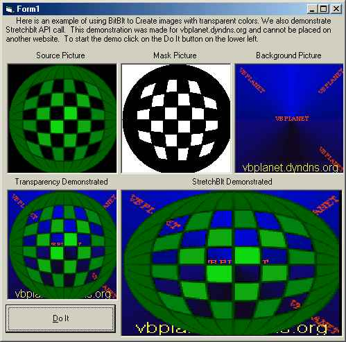

<div align="center">

## BitBlt with Transparencies, StretchBlt


</div>

### Description

To demonstrate using BitBlt and StretchBlt.
 
### More Info
 


<span>             |<span>
---                |---
**Submitted On**   |2001-02-10 00:23:40
**By**             |[http://www\.mp3trivia\.com](https://github.com/Planet-Source-Code/PSCIndex/blob/master/ByAuthor/http-www-mp3trivia-com.md)
**Level**          |Advanced
**User Rating**    |4.3 (13 globes from 3 users)
**Compatibility**  |VB 6\.0
**Category**       |[Graphics](https://github.com/Planet-Source-Code/PSCIndex/blob/master/ByCategory/graphics__1-46.md)
**World**          |[Visual Basic](https://github.com/Planet-Source-Code/PSCIndex/blob/master/ByWorld/visual-basic.md)
**Archive File**   |[CODE\_UPLOAD154592242001\.zip](https://github.com/Planet-Source-Code/http-www-mp3trivia-com-bitblt-with-transparencies-stretchblt__1-21315/archive/master.zip)

### API Declarations

```
Private Declare Function BitBlt Lib "gdi32" (ByVal hDestDC As Long, ByVal X As Long, ByVal Y As Long, ByVal nWidth As Long, ByVal nHeight As Long, ByVal hSrcDC As Long, ByVal xSrc As Long, ByVal ySrc As Long, ByVal dwRop As Long) As Long
Private Declare Function StretchBlt Lib "gdi32" (ByVal hdc As Long, ByVal X As Long, ByVal Y As Long, ByVal nWidth As Long, ByVal nHeight As Long, ByVal hSrcDC As Long, ByVal xSrc As Long, ByVal ySrc As Long, ByVal nSrcWidth As Long, ByVal nSrcHeight As Long, ByVal dwRop As Long) As Long
```


